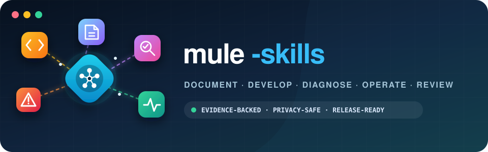

<p align="center">
  
</p>

<p align="center">
  <strong>Reusable AI-agent workflows for the Mule 4 engineering lifecycle.</strong>
</p>

Mule Skills gives coding agents a shared way to document, build, troubleshoot, operate, and review
MuleSoft projects. The workflows start from current-project evidence, keep business context separate
from implemented behavior, and avoid carrying identity or tuning assumptions between projects.

The skills work as instruction-only workflows and can use the included MCP configurations when
local build, lint, or authorized Anypoint evidence is available.

## Quick start

From the Mule project you want to configure, give your coding agent this instruction:

```text
Follow https://github.com/Avinava/mule-skills/blob/main/SETUP.md to install or reconcile the
MuleSoft skills for this repository. Preserve existing changes, configure only the agent hosts I
use, and show me the validation results before committing.
```

The setup runbook installs the skills under `.agents/skills/`, adds the build workflow, configures
only the selected MCP hosts, creates evidence-backed shared and host-specific project guidance, and
validates the result.

## Agent support

The five skills and build workflow are shared. Host-specific instruction files tell each agent how
to find them; MCP configuration is optional and installed only for hosts the project uses.

| Host | Repository instructions | Workflow access | MCP configuration | Verification |
| --- | --- | --- | --- | --- |
| Codex CLI, desktop, and IDE extension | `AGENTS.md` | Automatically discovers `.agents/skills/`; build workflow is referenced from project guidance | `.codex/config.toml` | `codex mcp list` |
| Claude Code | `CLAUDE.md` and `AGENTS.md` | `CLAUDE.md` routes tasks to `.agents/skills/*/SKILL.md` and `.agents/workflows/build.md` | `.mcp.json` | `claude mcp list` |
| GitHub Copilot in VS Code | `.github/copilot-instructions.md` and supported `AGENTS.md` surfaces | Copilot instructions route tasks to the installed workflows | `.vscode/mcp.json` | Reload VS Code and inspect its MCP server list |
| GitHub Copilot CLI | `.github/copilot-instructions.md` and `AGENTS.md` | Copilot instructions route tasks to the installed workflows | `.mcp.json` | `copilot mcp list` |
| Gemini coding agents | `GEMINI.md` and `AGENTS.md` | `GEMINI.md` routes tasks to the installed workflows | Host-specific merge from `mcp/mcp.json` when supported | Use the active host's MCP status view |
| Other compatible coding agents | `AGENTS.md` plus host-supported instruction files | Read the matching workflow directly from `.agents/` | Merge `mcp/mcp.json` only when the host accepts `mcpServers` | Use the host's documented MCP check |

Local MCP files do not configure GitHub-hosted Copilot agents or code review; configure hosted MCP
access through repository settings. Claude Code asks for approval before using project-scoped MCP
servers. See [SETUP.md](SETUP.md#4-configure-the-selected-mcp-host) for safe merge and verification
instructions.

Current host behavior is documented by [OpenAI Docs for Codex skills](https://developers.openai.com/codex/skills/),
[OpenAI Docs for Codex MCP](https://developers.openai.com/codex/mcp/),
[Anthropic's Claude Code guidance](https://docs.anthropic.com/en/docs/claude-code/memory), and
[GitHub Copilot custom-instruction guidance](https://docs.github.com/en/copilot/how-tos/configure-custom-instructions-in-your-ide/add-repository-instructions-in-your-ide).

## Included workflows

| Workflow | Use it for | Default result |
| --- | --- | --- |
| [`document-mulesoft-project`](skills/document-mulesoft-project/) | Project documentation, architecture, APIs, flows, onboarding, operations, and targeted refreshes | Evidence-backed Markdown and Mermaid, plus clearly labeled gaps |
| [`mule-development`](skills/mule-development/) | Mule XML, DataWeave, connectors, error handling, queues, batch, configuration, and MUnit changes | Implemented source change with proportionate validation |
| [`mule-troubleshooting`](skills/mule-troubleshooting/) | Incidents, timeouts, connection failures, rate limits, concurrency, memory, and cross-application failures | Root-cause assessment or fix plan; no source change unless requested |
| [`mule-ops`](skills/mule-ops/) | Runtime health, deployments, logs, metrics, recurring checks, and multi-application correlation | Evidence-backed operational assessment |
| [`review-mulesoft-project`](skills/review-mulesoft-project/) | Working changes, commits, branches, PRs, whole projects, and release readiness | Prioritized findings and fix options; no implementation or PR-state change unless requested |
| [`build`](workflows/build.md) | Validation, tests, packaging, and explicitly requested release actions | Deployable artifact and validation summary |

### Choosing the right workflow

| Request | Start with | Add when needed |
| --- | --- | --- |
| Explain or refresh the project | Documentation | Optional business-context questions when source cannot establish purpose or ownership |
| Implement a change | Development | Documentation refresh, then change review |
| Diagnose a symptom | Troubleshooting | Ops for authorized runtime evidence; development only when a fix is requested |
| Assess current runtime health | Ops | Troubleshooting when a specific causal question emerges |
| Review a change or repository | Project review | Ops only for authorized, material runtime verification |
| Prepare a release | Build | Release-readiness review before commit, tag, publish, or deploy |

Documentation and review questions are optional and non-blocking. When business information would
materially improve the result, the skill offers concise choices plus `Other` and `Not sure / Skip`,
then continues with verified technical evidence if the user skips.

## Operating principles

- **Evidence before assumption:** distinguish verified source or telemetry, user-provided context,
  inference, recommendations, and unresolved gaps.
- **Current project only:** never transplant application identity, topology, endpoints, payloads,
  schedules, volumes, incident fingerprints, or numeric tuning from another project.
- **Privacy by default:** never expose credentials, secret values, private keys, tenant identifiers,
  private hosts, personal data, or raw production payloads.
- **Proportionate validation:** use focused checks for local changes and the complete required gate
  for release readiness.
- **Shared mechanism model:** use Classes A–E for value, embedding, contract, failure, and state
  invariants, plus explicit cross-cutting security, capacity, delivery, privacy, and validation gates.
- **Explicit mutations:** reviews and diagnosis are read-only by default; commits, comments, tags,
  deployments, and releases require user authorization.
- **Honest uncertainty:** missing access or evidence remains visible instead of being converted into
  a confident claim.

## MCP support

The repository includes credential-free launch configurations for three pinned MCP servers:

| Server and source | Exact package pin | Role |
| --- | --- | --- |
| [`anypoint-connect`](https://github.com/Avinava/anypoint-connect) | [`@sfdxy/anypoint-connect@0.9.0`](https://registry.npmjs.org/@sfdxy%2Fanypoint-connect/0.9.0) | Authorized Anypoint logs, metrics, deployments, API management, Exchange, MQ, and Object Store evidence |
| [`mule-build`](https://github.com/Avinava/mule-build) | [`@sfdxy/mule-build@2.0.0`](https://registry.npmjs.org/@sfdxy%2Fmule-build/2.0.0) | Mule validation, testing, packaging, local runtime, versioning, and security checks |
| [`mule-lint`](https://github.com/Avinava/mule-lint) | [`@sfdxy/mule-lint@1.24.1`](https://registry.npmjs.org/@sfdxy%2Fmule-lint/1.24.1) | Static Mule analysis and machine-readable reports |

Source links come from each published package's repository metadata. Package links resolve to the
exact registry version used by the checked-in MCP launch configuration rather than an unpinned
latest release.

Templates are provided for Codex (`mcp/.codex/config.toml`), VS Code and GitHub Copilot
(`mcp/.vscode/mcp.json`), and hosts such as Claude Code or Copilot CLI that accept a project
`mcpServers` object (`mcp/mcp.json`). Configure only the host in use and merge with existing settings
rather than replacing them. The detailed procedure is in
[SETUP.md](SETUP.md#4-configure-the-selected-mcp-host).

Codex discovers repository-scoped skills from `.agents/skills/` between the working directory and
the repository root. See the official [Codex skills documentation](https://developers.openai.com/codex/skills/)
and [Codex MCP documentation](https://developers.openai.com/codex/mcp/) for current host behavior.

## Repository layout

```text
mule-skills/
├── assets/                         # Project artwork
├── skills/
│   ├── document-mulesoft-project/  # Documentation workflow, references, and audit tools
│   ├── mule-development/           # Implementation workflow and post-change checklist
│   ├── mule-troubleshooting/       # Root-cause analysis workflow
│   ├── mule-ops/                   # Runtime health workflow
│   └── review-mulesoft-project/    # Change, project, and release-readiness review
├── workflows/build.md              # Validate, package, and explicit release workflow
├── scripts/                         # Dependency-free repository validation
├── tests/                           # Validator and checker tests
├── templates/                      # Project-owned AGENTS, Claude, Copilot, and Gemini guidance
├── mcp/                            # Codex, VS Code, and generic JSON MCP templates
├── README.md                       # Toolkit overview
└── SETUP.md                        # Installation and reconciliation runbook
```

Each skill has a required `SKILL.md` and may include:

- `agents/openai.yaml` for interface metadata;
- `references/` or `resources/` for guidance loaded by the workflow;
- `scripts/` for deterministic, repeatable inspection and validation.

Run `python3 -m unittest discover -s tests -v` and `python3 scripts/validate_repository.py .` when
changing reusable skills. CI runs those checks plus the documentation audit.

Host instruction templates keep shared project facts in `AGENTS.md` and add only the routing needed
by Claude Code, GitHub Copilot, or Gemini. They are `templates/AGENTS.md`, `templates/CLAUDE.md`,
`templates/copilot-instructions.md`, and `templates/GEMINI.md`; the support matrix above shows their
installed locations and MCP configuration.

After installation, the shared project layout is:

```text
your-mule-project/
├── .agents/
│   ├── skills/                     # The five reusable Mule skills
│   └── workflows/build.md
├── .codex/config.toml              # Optional Codex MCP configuration
├── .vscode/mcp.json                # Optional VS Code MCP configuration
├── .mcp.json                       # Optional Claude Code or Copilot CLI MCP configuration
├── .github/copilot-instructions.md # Optional GitHub Copilot repository instructions
├── AGENTS.md                       # Evidence-backed project context
├── CLAUDE.md                       # Optional Claude Code guidance
├── GEMINI.md                       # Optional host-specific guidance
├── pom.xml
└── src/
```

## Example prompts

```text
Use $document-mulesoft-project to refresh architecture and operations documentation. Ask optional
business questions with choices where the repository cannot establish important context.

Use $mule-development to implement this Mule change and complete the post-development checklist.

Use $mule-troubleshooting to diagnose this timeout. Separate observations, hypotheses, confirmed
causes, and unresolved gaps.

Use $mule-ops to assess runtime health for the requested environment and time window.

Use $review-mulesoft-project in change-review mode for this branch. Report findings and fix options;
do not modify source or post PR comments.

Use the build workflow to package the application. Do not release, tag, deploy, or push.
```

## Contributing

When adding or changing a reusable skill:

1. Keep the workflow focused and give its `SKILL.md` a precise trigger description.
2. Put project-specific identity, topology, and operating facts in the consuming repository, never
   in this reusable repository.
3. Use neutral examples and mechanism-based guidance; do not retain prior-project fingerprints or
   numeric tuning values.
4. Add `agents/openai.yaml` and only the references, resources, scripts, or assets the skill needs.
5. Validate the skill, test it with neutral representative tasks, and inspect outputs for unsupported
   claims or sensitive data.
6. Update README and SETUP when discovery, installation, routing, or required resources change.

## License

Private repository — internal use only.
