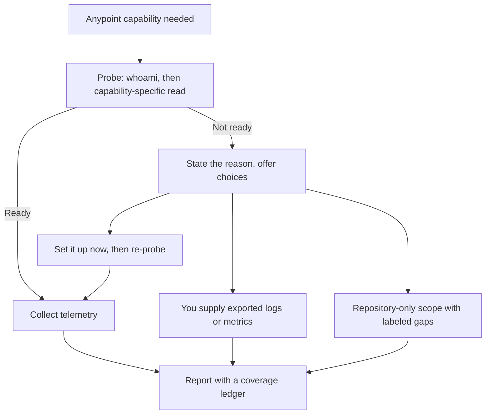

# Anypoint access

`anypoint-connect` is the only one of the three MCP servers that needs authentication. `mule-build`
and `mule-lint` work with no credentials.

Set this up for runtime evidence or requested design-platform work: Design Center, Exchange,
centralized API Governance, logs, metrics, deployments, API Manager, queues, or Object Store. Skip it
for local contract design/validation, documentation, development, lint, build, packaging, or static review.

## What happens when it is not set up

The skills do not fail silently and do not stall. `mule-api-design`, `mule-ops`,
`mule-troubleshooting`, `mule-review`, and publish/deploy actions in `mule-build` probe the required capability before their first connector
call, then tell you which state they found and offer a choice.



Two consequences worth knowing:

- **Nothing blocks.** A review or a diagnosis still completes from repository evidence; the report
  names the coverage it could not reach.
- **Exports are second-class on purpose.** Logs and screenshots you paste in are labeled
  user-provided with the coverage you state. They can support a correlation, but absence of an entry
  in a truncated or filtered export never proves absence.

| Skill | With access | Without access |
| --- | --- | --- |
| `mule-api-design` | Design Center/Exchange/Governance reads and separately approved writes | Local design, authoring, and AMF validation continue normally |
| `mule-ops` | Full runtime health assessment | Repository and configuration review, or analysis of exports you supply |
| `mule-troubleshooting` | Telemetry-confirmed root cause | Source-based hypotheses with the discriminating checks named |
| `mule-review` | Optional runtime verification of a finding | Complete review with the runtime gap disclosed |
| `mule-build` | Authorized publish and deploy | Validate, test, and package as normal |

## Set it up

Run these yourself. An agent following these skills will print them rather than run them, because
they change machine-local state.

```bash
npx -y @sfdxy/anypoint-connect@0.12.0 config init
npx -y @sfdxy/anypoint-connect@0.12.0 auth login
npx -y @sfdxy/anypoint-connect@0.12.0 auth status
```

A global install gives you the shorter `anc` command:

```bash
npm install -g @sfdxy/anypoint-connect@0.12.0
anc config init
anc auth login
anc auth status
```

Use the same pin the MCP configuration uses. A CLI on one version and an MCP server on another is a
confusing way to debug a login problem.

### Multiple organizations

Use a neutral local profile identifier rather than an organization or customer name:

```bash
anc config init --profile org-a
anc auth login --profile org-a
anc config use org-a
anc auth status
```

`anc config use` writes `.anypoint-connect.json` in the project. It binds a machine-local profile
rather than storing credentials, but it can reveal local organization labeling, so add it to
`.gitignore`:

```gitignore
.anypoint-connect.json
```

## Verify

Two things have to be true: the MCP server is configured in your host, and the CLI profile is
authenticated. Check them separately, because the fixes are different.

| Check | How | Fix if it fails |
| --- | --- | --- |
| Server configured | `/mcp` in Claude Code, `codex mcp list`, `copilot mcp list`, or your host's MCP view | Install path for your host: [Claude Code](install-claude-code.md), [other agents](install-other-agents.md) |
| Authenticated | `anc auth status` | `anc auth login` |
| Visible to the agent | Ask the agent to confirm Anypoint access | See the failure modes below |

Runtime readiness uses `whoami` and `list_environments`. Design readiness uses `whoami` and
`list_design_center_projects`; it does not require runtime environment visibility. The skills redact
identity and organization details from their report.

## Failure modes

| State | What you see | Fix |
| --- | --- | --- |
| Not configured | The host exposes no `anypoint-connect` tools at all | Add the MCP entry for your host, then restart or reload it. Login is not the problem |
| Not authenticated | Tools exist but report missing, invalid, or expired credentials | `anc auth login`, then re-check `anc auth status` |
| Environment not visible | Authentication works, but the environment you asked about is absent | Wrong organization or profile, a business-group boundary, or a misspelled environment name. Check `anc config use` and the environment list |
| Not permitted | Authentication and environment resolve, but an operation is refused | The identity or the subscription lacks that capability. Use an identity with the right scope, or supply an export instead |
| Transient failure | Timeout, rate limit, or server error | Retry once with a narrower window before treating it as an access problem |

A first `npx` start also downloads the package, so a cold start can look like a hang. Wait for it
once; later starts use the cache.

## Privacy

The skills already treat organization and identity detail as sensitive, and they will not put it in
a report. Keep the same boundary yourself:

- Do not commit `.anypoint-connect.json`.
- Do not paste tokens or credentials into a chat. The CLI holds the session; the agent never needs
  the secret itself.
- Redact identifiers, private hostnames, and payloads from logs you supply, or expect the skill to
  paraphrase and redact them in the output.
- Exported telemetry belongs outside the repository. Point the agent at a path; do not commit the
  file.

## What the skills do with access

The readiness workflow the skills follow lives in the repository at
[`skills/mule-ops/references/anypoint-readiness.md`](https://github.com/Avinava/mule-skills/blob/main/skills/mule-ops/references/anypoint-readiness.md).
It defines the probe, the access states, the choices offered, the metadata required for supplied
exports, and the rule that an access state appears in the report whenever it limited scope.
