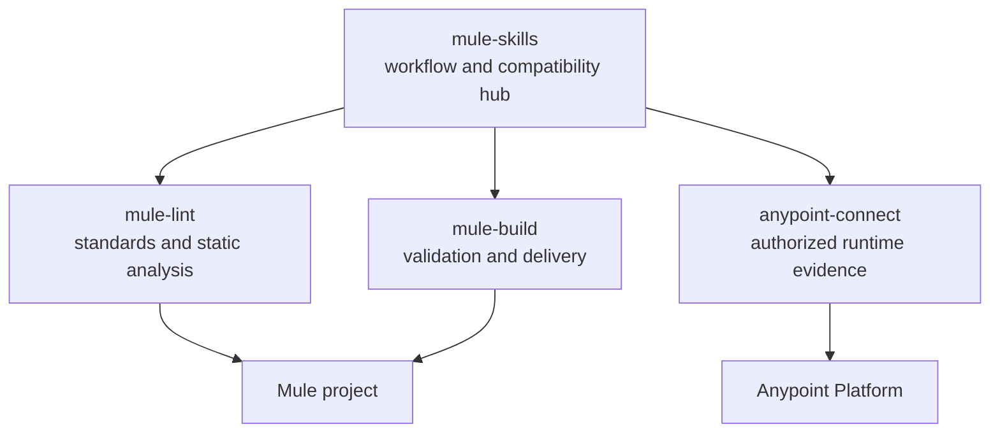

# Ecosystem

This is the canonical compatibility and ownership map for the Mule agent toolkit. The current
bundle is `mule-skills@1.5.0`; its MCP dependencies are pinned exactly so an
installation is reproducible.

| Project | Exact package | Owns | Credentials | Reference |
| ------- | ------------- | ---- | ----------- | --------- |
| [`anypoint-connect`](https://github.com/Avinava/anypoint-connect) | `@sfdxy/anypoint-connect@0.12.0` | Authorized Anypoint evidence, Design Center workflows, and lifecycle operations | Anypoint Platform login | [Docs](https://avinava.github.io/anypoint-connect/) |
| [`mule-build`](https://github.com/Avinava/mule-build) | `@sfdxy/mule-build@2.2.0` | Validate, test, package, run locally, and release Mule applications | None | [Docs](https://avinava.github.io/mule-build/) |
| [`mule-lint`](https://github.com/Avinava/mule-lint) | `@sfdxy/mule-lint@1.28.0` | Canonical standards, Mule static analysis, and RAML/OAS contract validation | None | [Docs](https://avinava.github.io/mule-lint/) |

## Ownership boundaries

- **mule-lint owns engineering standards.** Best-practice guides, source classifications,
  executable lint rules, rule profiles, and their MCP resources are maintained together there.
- **mule-build owns local delivery mechanics.** It validates, tests, packages, runs, publishes, and
  releases without redefining source-quality standards.
- **anypoint-connect owns authorized platform evidence and mutations.** It exposes the current
  Anypoint state; it does not encode project conventions.
- **mule-skills owns composition.** Skills decide which evidence and tools a workflow needs, while
  referring to mule-lint standards instead of copying them.



## Version management

Tool repositories release independently. A successful tool release sends a repository dispatch to
this repository. Automation updates `ecosystem.json`, regenerates host configuration and this page,
runs validation, and opens a pull request. A maintainer reviews and merges that PR; no dependency
event auto-merges or releases `mule-skills`.

Each tool repository needs a `MULE_SKILLS_DISPATCH_TOKEN` Actions secret backed by a fine-grained
token or GitHub App installation that has **Contents: write** on `Avinava/mule-skills`. If the secret
is absent, the release completes with a warning and the same update can be started manually from the
`Propose ecosystem pin update` workflow.

The generator is deterministic:

```bash
python3 tools/generate_ecosystem.py --check
```

To prepare a pin update locally:

```bash
python3 tools/update_ecosystem.py mule-lint 1.26.0
```

Release a new `mule-skills` minor version when skills, compatibility policy, host configuration, or
the user-facing bundle changes. A dependency-only compatible pin refresh can be a patch release.
