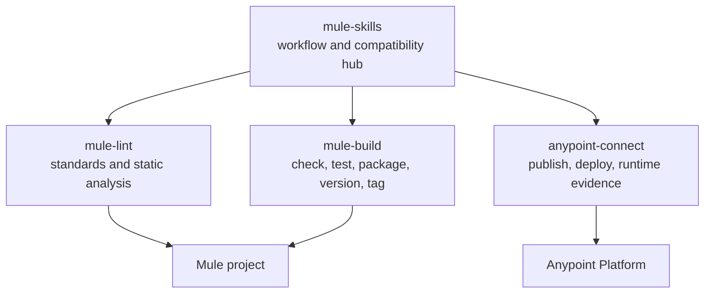

# Ecosystem

This is the canonical compatibility and ownership map for the Mule agent toolkit. The current
bundle is `mule-skills@1.8.0`; its MCP dependencies are pinned exactly so an
installation is reproducible.

| Project | Exact package | Node.js | Owns | Credentials | Reference |
| ------- | ------------- | ------- | ---- | ----------- | --------- |
| [`anypoint-connect`](https://github.com/Avinava/anypoint-connect) | `@sfdxy/anypoint-connect@0.13.0` | `>=22.0.0` | Authorized Anypoint evidence, Design Center workflows, and lifecycle operations | Anypoint Platform login | [Docs](https://avinava.github.io/anypoint-connect/) |
| [`mule-build`](https://github.com/Avinava/mule-build) | `@sfdxy/mule-build@2.3.0` | `>=20.19.0` | Validate, test, package, run locally, and prepare versioned and tagged Mule artifacts | None | [Docs](https://avinava.github.io/mule-build/) |
| [`mule-lint`](https://github.com/Avinava/mule-lint) | `@sfdxy/mule-lint@1.30.1` | `>=20.0.0` | Canonical standards, Mule static analysis, XML formatting, and RAML/OAS contract validation | None | [Docs](https://avinava.github.io/mule-lint/) |

Node.js `>=22.0.0` satisfies the complete bundle. Node.js 24 LTS is recommended for a new
installation.

## Ownership boundaries

- **mule-lint owns engineering standards.** Best-practice guides, source classifications,
  executable lint rules, rule profiles, and their MCP resources are maintained together there.
- **mule-build owns local delivery mechanics.** It validates, tests, packages, runs locally, and
  prepares versioned and tagged artifacts without redefining source-quality standards.
- **anypoint-connect owns authorized platform evidence and mutations.** It exposes the current
  Anypoint state and performs explicitly approved Exchange publishing or runtime deployment; it does
  not encode project conventions.
- **mule-skills owns composition.** Skills decide which evidence and tools a workflow needs, while
  referring to mule-lint standards instead of copying them.


```mermaid
flowchart TD
    Skills["mule-skills<br/>workflow and compatibility hub"] --> Lint["mule-lint<br/>standards and static analysis"]
    Skills --> Build["mule-build<br/>check, test, package, version, tag"]
    Skills --> Connect["anypoint-connect<br/>publish, deploy, runtime evidence"]
    Lint --> Project["Mule project"]
    Build --> Project
    Connect --> Platform["Anypoint Platform"]
```

## Machine-checked capability boundaries

These minimum tool/input/resource expectations come from `ecosystem.json`, alongside the
unchanged release pins. The executable smoke checks discovery against them; a missing tool,
input property/type, newly required argument, rejected representative enum value or public
resource fails compatibility. Samples cover minimal and common inputs without invoking build or
platform tools. This is bounded discovery validation, not a full JSON Schema validator or an
authenticated integration test. Extra capabilities remain allowed.
This is a consumer conformance fixture, not a second registry of server implementations.

| Owner | Required tools (input fields) | Required resources |
| --- | --- | --- |
| `anypoint-connect` | `search_exchange` (query), `publish_app_jar` (jarPath, confirm) | Discovery only |
| `mule-build` | `run_build` (cwd), `run_tests` (cwd), `get_project_config` (cwd) | Discovery only |
| `mule-lint` | `run_lint_analysis` (projectPath, profile), `validate_snippet` (code, type) | `mule-lint://rules`, `mule-lint://standards` |

The owning tool documents its schemas and semantics. This hub links to those docs instead of
copying rule implementations or platform/build policies. Report-v1 remains capability-detected:
local-source validation does not assert support in an older pinned release. No runtime package
coupling is introduced between the tools.

## Execution evidence and artifact handoff

Skills consume the canonical lint report only when the installed executable supports it:
`structuredContent.schemaVersion`, `execution`, and `findings` are top-level MCP fields;
`--format report-json` is the CLI equivalent. Legacy `--format json` remains a flat array.
An `incomplete` or `no-files` execution never establishes a passed scan, even under quiet output,
baselines, or permissive gates. A `complete` scan covers only its recorded scope and enabled rules.
Missing or unknown scope must be disclosed. Older releases without this contract leave completeness
unverified; do not interpret zero findings or quality ratings as proof of completion.

The build secure-reference precondition checks a narrow property-reference policy. It does not
prove encryption correctness, runtime secret safety, or a full security assessment. Build and
connector remain independent of a mandatory lint dependency; skills coordinate separately configured
checks and report each outcome.

For artifact handoff, retain the exact JAR path, embedded Maven group/artifact/version, and SHA-256
when available. Display names and timestamped filenames are not coordinates. The connector's
`expectedSha256` protects the reviewed bytes when supported. Preview the destination and explicitly
approved coordinate mappings, preserve confirmation/authentication safeguards, then use returned
publication coordinates for deployment. Publication success is not runtime verification. If an older
release lacks required identity/digest support, disclose the gap instead of silently dropping it.

## Executable compatibility checks

Run the default check against the exact published pins in `install/hosts/mcp.json`:

```bash
python3 tools/compatibility_smoke.py
```

This starts each server with a temporary home and no inherited application/npm credentials,
preserving only configured proxy and CA transport settings for registry access. It initializes MCP and
lists tools/resources. The connector receives synthetic client placeholders and a loopback base URL
solely to satisfy its configuration prerequisite; it never logs in. Only public lint resources and synthetic local lint fixtures are read; no
build, authenticated Anypoint, publication, deployment, or other mutation tools are called. The first
run downloads pinned npm packages with lifecycle scripts disabled, so registry access is required.
Discovery success is not an authenticated platform integration test.

For coordinated development, build each of the three repositories first, then point to their common
parent directory without changing published pins:

```bash
python3 tools/compatibility_smoke.py --source-root <source-root> --require-report-v1
```

`--require-report-v1` rejects legacy-only results. A report-v1 server must prove complete, malformed,
and no-files states, top-level structured output, CLI/MCP finding parity, and legacy flat JSON.
The default mode reports the older release's limited evidence explicitly; it never treats legacy
text as verified execution completeness. Local-source success does not certify the published pins.

## Version management

Tool repositories release independently. A successful tool release sends a repository dispatch to
this repository. Automation updates `ecosystem.json`, regenerates host configuration and this page,
runs structural and executable compatibility validation, and opens a pull request. A maintainer reviews and merges that PR; no dependency
event auto-merges or releases `mule-skills`.

Each tool repository needs a `MULE_SKILLS_DISPATCH_TOKEN` Actions secret backed by a fine-grained
token or GitHub App installation that has **Contents: write** on `Avinava/mule-skills`. If the secret
is absent, the release completes with a warning and the same update can be started manually from the
`Propose ecosystem pin update` workflow.

The generator is deterministic:

```bash
python3 tools/generate_ecosystem.py --check
```

To prepare a pin update locally:

```bash
python3 tools/update_ecosystem.py mule-lint 1.30.1   --node '>=20.0.0'
```

Keep existing pins until a published release passes the executable check. Use
`--require-report-v1` before claiming that a proposed lint release provides the new report contract.

The pin-update workflow uses `GITHUB_TOKEN`. GitHub may hold the resulting pull-request checks
for maintainer approval; use **Approve workflows to run** on the proposed PR when shown, and wait
for its checks before merging. See [GitHub's workflow trigger documentation](https://docs.github.com/en/actions/how-tos/write-workflows/choose-when-workflows-run/trigger-a-workflow).
The proposal workflow's own validation is not a substitute for the PR's required checks.

The bundle version in `ecosystem.json` and the plugin manifest must agree. The marketplace uses
that plugin manifest; it does not introduce another independently versioned package. Source versions
and changelog entries can precede a GitHub release; do not create a tag merely to hide that distinction.
Tool package versions, this bundle version, and GitHub releases are separate release decisions.

Documentation follows the default branch through a strict Pages build independently of tool or
bundle tags. Manual Pages publication also requires the default branch. Pull-request documentation
checks do not deploy the site. Keep unpublished capabilities explicitly capability-detected until
published packages pass compatibility validation and the reviewed pin update is merged.

Release a new `mule-skills` minor version when skills, compatibility policy, host configuration, or
the user-facing bundle changes. A dependency-only compatible pin refresh can be a patch release.
