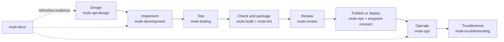

<div class="hero" markdown>

{ width="760" }

# Give your coding agent a MuleSoft engineering playbook

Mule Skills helps Codex, Claude, Copilot, Gemini, Cursor, and similar agents work with Mule 4
projects using the same lifecycle your team already knows: design, develop, test, package, review,
operate, and troubleshoot.

[Install in a Mule project](getting-started.md){ .md-button .md-button--primary }
[See it in action](see-it-in-action.md){ .md-button }

</div>

No agent replaces Anypoint Studio, Maven, MUnit, or your review process. The skills tell the agent
how to inspect current-project evidence, choose the right tool, validate proportionately, and stop
before a mutation that needs your approval.

<div class="path-grid" markdown>

<div class="path-card" markdown>

### MuleSoft developer

Describe the change in Mule terms. The agent routes between API design, Mule XML/DataWeave,
documentation, MUnit, build, and review.

[See a developer change](see-it-in-action.md)

</div>

<div class="path-card" markdown>

### Test or release engineer

Use behavior-focused MUnit guidance, repeatable build gates, artifact evidence, and a separate
approval boundary for Anypoint publishing or deployment.

[Follow a workflow](workflows.md)

</div>

<div class="path-card" markdown>

### Platform or support engineer

Analyze runtime health and incidents from authorized Anypoint evidence or supplied exports without
turning missing telemetry into a confident conclusion.

[Understand Anypoint access](anypoint-access.md)

</div>

</div>

## The Mule lifecycle, with clear ownership



`mule-build` owns local checks, MUnit execution, packaging, local runtime work, and version/tag
preparation. `anypoint-connect`, used through operational workflows, owns explicitly approved
Exchange publishing and Anypoint runtime changes. [See the complete ownership map](ecosystem.md).

## Paste one instruction

Open your Mule repository in the agent and paste:

```text
Fetch and follow https://raw.githubusercontent.com/Avinava/mule-skills/main/docs/agent-install.md
to install or update Mule Skills in this Mule repository. Detect the agent host and existing
configuration, preview the changes, preserve customized files, run the validation, and do not
commit or authenticate to Anypoint unless I approve it.
```

The agent inspects first, detects an existing install, previews file and MCP changes, avoids
duplicate configuration, installs all eight skills, validates the result, and leaves commit and
authentication decisions with you. [Walk through the result](getting-started.md).

## What gets installed

| Layer | Purpose | Credentials |
| --- | --- | --- |
| Eight `mule-*` skills | Decide how to design, implement, test, document, build, review, operate, and diagnose | None |
| `mule-lint@1.29.1` | Mule standards, static analysis, XML formatting, RAML/OAS validation | None |
| `mule-build@2.3.0` | Readiness, MUnit, package, local runtime, version and tag preparation | None |
| `anypoint-connect@0.13.0` | Authorized Design Center, Exchange, Governance, telemetry, and lifecycle actions | Anypoint login only when needed |

Use Node.js `>=22.0.0` for the MCP servers; Node.js 24 LTS is recommended. The skills
themselves are instructions and remain useful when an MCP server is unavailable—the missing tool
becomes a visible validation gap.

## Safety you can predict

| Request | Default behavior |
| --- | --- |
| Review or diagnose | Read-only findings; no source or PR changes |
| Develop or repair tests | Implement only the requested scope and run focused plus proportionate checks |
| Build | Validate, run MUnit, and package; no version, tag, publish, or deploy |
| Release preparation | Preview/check first; version, commit, tag, or push only when explicitly requested |
| Publish, deploy, restart, scale, or rollback | Separate Anypoint scope, readiness probe, and explicit approval |

Project facts stay in the Mule repository's `AGENTS.md`; reusable skill files stay neutral. Private
hosts, tenant identifiers, credentials, payloads, and customer fingerprints do not belong in either
the reusable bundle or examples.
