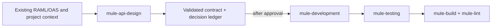
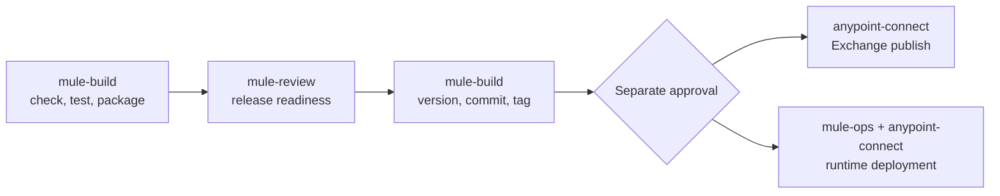

# Workflow examples

The skills compose around a task. You describe the desired Mule outcome; the agent selects the
smallest useful workflow and adds another skill only when the task crosses a real ownership boundary.

## Design and implement an API change

```text
Design a GET /orders/{orderId} operation for the existing Orders System API. Reuse the repository's
RAML conventions, record unresolved consumer decisions, validate the contract, and stop before
implementing it.
```

Expected path:



The design skill does not claim that APIKit implementation or Design Center publication happened.
Those are later, separately evidenced steps.

## Implement and test Mule behavior

```text
Implement the approved order lookup behavior. Preserve the current error contract, add focused MUnit
coverage, refresh only documentation made stale, and review the resulting change.
```

The agent should:

1. read repository instructions and current Mule/runtime/connector versions;
2. implement production XML or DataWeave through `mule-development`;
3. author behavior-faithful tests through `mule-testing`;
4. run focused and required full validation through `mule-build` and `mule-lint`;
5. refresh affected documentation and return a read-only review.

An implementation request authorizes source changes inside that scope. It does not authorize a
commit, push, version bump, runtime change, or deployment.

## Validate and package

```text
Validate and package this Mule application. Run the established security, lint, and MUnit gates and
report the exact artifact. Do not skip tests or perform release actions.
```

`mule-build` uses repository commands first and the pinned `mule-build@2.3.0` tool when configured.
The normal sequence is read-only readiness, static/security checks, MUnit, package, then artifact
verification. A package result should make these visible:

```text
Mode: package
Validation: passed
MUnit: 18 run, 0 failed, 1 skipped
Artifact: target/orders-system-api-1.4.2.jar
Changed by workflow: target/ only
Release actions: none
```

## Prepare, publish, and deploy a release

This is deliberately two ownership zones:



A request to “prepare a release” stops with a versioned/tagged local candidate unless the user also
explicitly requests and approves the Anypoint action. A successful artifact is never treated as
deployment approval.

## Diagnose an incident

```text
Find the cause of the order API timeout increase between 09:00 and 10:00 UTC. Use authorized runtime
evidence if available; otherwise tell me which exports you need. Diagnose only—do not change source,
configuration, or runtime state.
```

`mule-troubleshooting` traces the symptom through code, configuration, dependencies, logs, metrics,
and change windows. `mule-ops` gathers authorized runtime evidence. If access is missing, the result
labels the coverage gap and offers setup, supplied exports, or repository-only analysis.

## Refresh project documentation

```text
Refresh onboarding, architecture, and operations documentation for this Mule project. Use source and
committed configuration as evidence, label inferred business purpose, and never expose secret values
or private endpoints.
```

`mule-docs` inventories the current repository and creates only evidenced pages. It can show flow and
dependency relationships with Mermaid, while keeping missing ownership or operational facts visible
instead of inventing them.

## Review before asking for fixes

```text
Review the current branch for Mule correctness, contract drift, MUnit gaps, configuration safety,
and release readiness. Report prioritized findings and fix options; do not modify files or PR state.
```

Review is read-only. After you accept a finding, ask `mule-development`, `mule-testing`, or
`mule-build` to implement the specific fix and rerun the affected gate.
