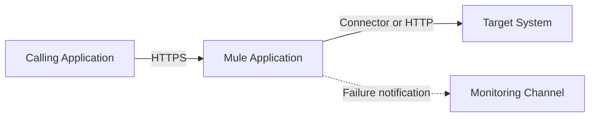
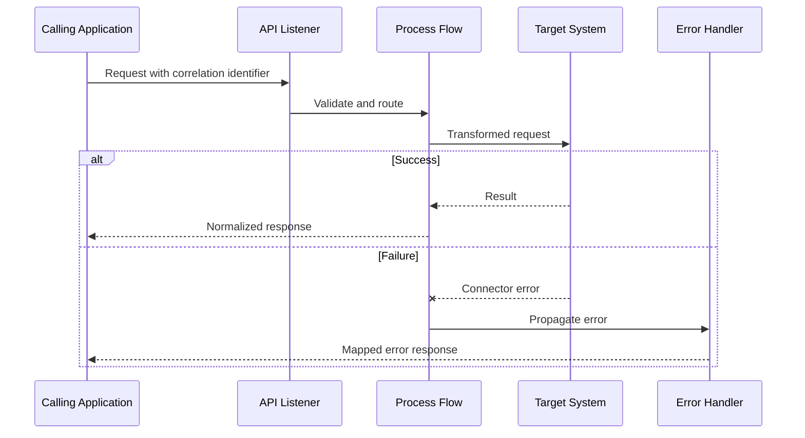
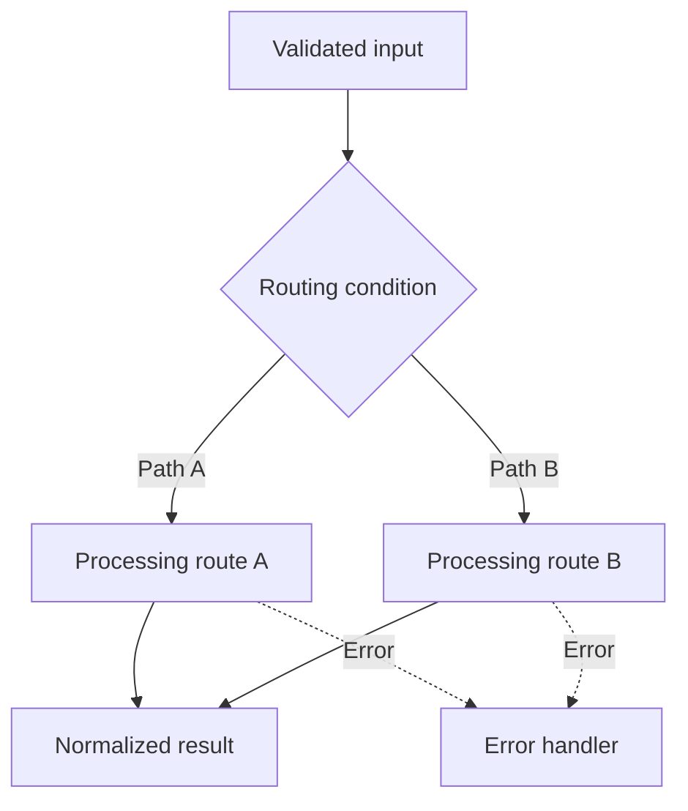

# Mermaid guide

## Contents

1. [Choose the diagram](#choose-the-diagram)
2. [Readability rules](#readability-rules)
3. [System context](#system-context)
4. [Runtime sequence](#runtime-sequence)
5. [Routing and errors](#routing-and-errors)
6. [Validation](#validation)

## Choose the diagram

Use a diagram only when it clarifies a relationship, sequence, branch, or state transition better
than a small table.

| Question                           | Mermaid type      |
| ---------------------------------- | ----------------- |
| What systems interact?             | `flowchart LR`    |
| What happens over time?            | `sequenceDiagram` |
| How does routing branch?           | `flowchart TD`    |
| What states can a batch/job enter? | `stateDiagram-v2` |

Do not create a diagram merely because a document has an architecture section. A simple project may
need only one context diagram and one sequence.

## Readability rules

- Keep a diagram to roughly twelve nodes or participants. Split larger diagrams by concern.
- Label nodes with roles or stable component names, not confidential deployment identities.
- Use short edge labels that describe protocol, event, or decision.
- Put detailed paths and source locations in surrounding prose or tables.
- Keep the happy path visually dominant; use dotted edges for error routing.
- Avoid custom themes, raw HTML beyond simple ` `, click handlers, and renderer-specific
  extensions.
- Avoid punctuation in node identifiers. Put punctuation inside quoted labels.
- Use aliases in sequence diagrams when component names contain special characters.
- Explain every diagram in one short paragraph and cite the source flows it represents.

## System context

Use neutral roles and replace them with current-project names only after verifying them:

Do not infer that every configured connector participates in the primary path. Include only
dependencies reached from the documented flow.

## Runtime sequence

Show meaningful stages instead of every processor:

Represent asynchronous handoffs with an explicit queue/event participant. Do not draw a synchronous
return when the source does not wait for one.

## Routing and errors

Use a flowchart for choices that materially change the downstream behavior:

An error diagram should show observable outcomes: propagate, continue, retry, writeback, dead-letter,
or notification. Do not turn an error-type list into a large diagram when a table is clearer.

Use `stateDiagram-v2` only when actual persisted or runtime states and transitions exist. Never
invent a state machine from chronological steps.

## Validation

For every changed Mermaid block:

1. Confirm the opening and closing fences are balanced.
2. Confirm the first content line is a supported diagram directive.
3. Parse or render the diagram with the project's renderer or Mermaid CLI when available.
4. Inspect the rendered result for crossed edges, clipped labels, and excessive width.
5. Confirm node and edge labels match the source and nearby prose.
6. Confirm the diagram contains no secret, personal, customer-derived, or local-machine value that
   should not be published.
