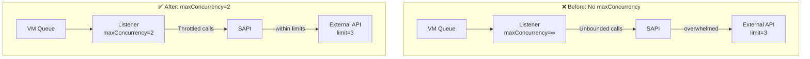

# MuleSoft Troubleshooting & RCA Guide

This skill provides a structured approach to diagnosing and resolving complex timeout, concurrency, and connection issues in a multi-tier MuleSoft architecture (e.g., PAPI calling SAPI calling external systems like NetSuite or Salesforce).

## Phase 1: Log Collection & Analysis

When a system is experiencing instability, errors, or timeouts, follow these log analysis steps first.

### 1. Collect Comprehensive Logs
Do not rely on a small sample of logs. Pull a large enough dataset to identify patterns (e.g., 24 hours of logs).
*   Use the `mcp_anypoint-connect_get_logs` or `download_logs` tools to pull logs from **all participating applications** in the flow (e.g., both PAPI and SAPI).
*   Ensure you are pulling logs for the specific environment where the issue occurs (e.g., Production).

### 2. Identify the Primary Error Signature
Scan the logs to find the most frequent and critical errors. Look for:
*   **Timeout Errors:**
    *   `java.util.concurrent.TimeoutException`
    *   `org.glassfish.grizzly.filterchain.IdleTimeoutFilter` (Indicates a connection was closed because it was idle longer than the configured timeout).
    *   `HTTP GET/POST/PATCH on resource '...' failed: Timeout exceeded.`
*   **Concurrency/Rate Limit Errors:**
    *   `too many requests (429)` (Indicates an API is being hit too fast).
    *   `concurrent request limit exceeded` (e.g., SuiteTalk SOAP limits).
*   **Connection Refused/Bad Gateway (502/503/504):** Can indicate the downstream system is down or overwhelmed.

### 3. Trace the Error Chain (Correlation)
*   Use the `correlationId` to trace a failing request across multiple applications (e.g., from PAPI to SAPI to an external system).
*   Determine *which system* is generating the error and *which system* is logging it. For example, if PAPI logs a Grizzly timeout when calling SAPI, the issue might be SAPI closing the connection prematurely, or SAPI taking too long to process.

### 4. Group Errors by Time and Frequency (Burst Analysis)
*   Are the errors continuous, or do they happen in bursts?
*   **Burst Example:** If 100 `429 Too Many Requests` errors occur within 15 seconds every 6 hours, immediately look for a scheduled batch job running at that interval.

## Phase 2: Root Cause Analysis (RCA)

Once the error patterns are clear, investigate the configuration and code to find the root cause.

### 1. Timeout Mismatches (The "Grizzly" Problem)
If you see `IdleTimeoutFilter` errors, compare the timeout settings across the request chain.
*   **Rule of Thumb:** The upstream system (e.g., PAPI) should have an `idleTimeout` that is **less than or equal to** the downstream system's (e.g., SAPI) `idleTimeout`.
*   **Check:** Look at HTTP Requester configs in the calling app, and HTTP Listener configs in the receiving app.
*   **Example Failure:** PAPI requester `idleTimeout` = 300s, SAPI listener `idleTimeout` = 60s. PAPI waits 300s, but SAPI drops the connection after 60s of inactivity, causing a Grizzly error in PAPI when it tries to use the dead connection.

### 2. Concurrency Overload & Throttling
If you see 429 errors or "concurrent request limit exceeded":
*   **Batch Jobs:** Check `batch:job` configurations. A high `blockSize` (e.g., 100) will fire all records in the block concurrently. If downstream APIs have strict rate limits, this will cause 429s.
*   **Queue Listeners:** Check VM or Anypoint MQ listeners. If `numberOfConsumers` is set but `maxConcurrency` is NOT set on the flow, it can lead to unbounded concurrency.
*   **Flow Concurrency:** Check if `maxConcurrency` is explicitly set on flows handling heavy loads.
*   **External Limits:** Understand the connection limits of the external system (e.g., NetSuite SOAP `maxConnection=3`). Ensure the upstream Mule apps are throttled to never send more concurrent requests than the downstream system can handle.

### 3. Resource Contention
*   Check Anypoint Monitoring for CPU and Memory usage spikes correlating with error bursts. High CPU can cause thread starvation and cascading timeouts.

### 4. Deploy-Induced Error Bursts
If errors cluster in a **1-5 second window** immediately after a deploy timestamp in the audit log, it's deploy noise — not a real issue.

**Signature:**
- `LifecycleException: "X" is stopped` or `MULE:UNKNOWN` errors
- 50-200 errors in a 2-3 second burst
- All errors in the same thread group, typically from VM queue listener flows
- No errors before or after the burst window

**Root cause:** During a rolling deploy, old replicas begin shutting down while VM queue listeners still have messages in-flight. Components that have already stopped throw `LifecycleException` when the listener tries to route the message.

**How to confirm:**
1. Pull the audit log: `get_audit_log(hoursBack: 48, objectTypes: ["Application"])`
2. Convert deploy timestamps from epoch ms to UTC
3. Compare with the error spike windows from `get_log_stats`
4. If the deploy timestamp falls within 1 minute before the error burst → deploy noise

**Prevention:** See the "VM Listener Shutdown Error Handler" pattern in the `mule-development` skill — add an error handler that catches `"is stopped"` / `LifecycleException` at WARN level.

> **Real-world example:** A deploy produced 118 `LifecycleException` errors (92% of all errors in a 12h window) in a 2-second burst. Error rate appeared to be 2.28%, but actual application error rate was ~0.2%.

## Phase 3: Creating the Fix Plan

Based on the RCA, design targeted fixes. Document these in an `implementation_plan.md` artifact.

### 1. Fix Configuration Mismatches
*   **Action:** Align timeouts. Increase the downstream listener's `idleTimeout` and `readTimeout` to comfortably exceed the expected processing time and align with the upstream requester's expectations.

### 2. Implement Strategic Throttling
*   **Batch Jobs:** Reduce `blockSize` to a level the downstream API can handle (e.g., from 100 to 10). This trades speed for reliability.
*   **Queue Listeners:** Add explicit `maxConcurrency="[X]"` attributes to listener flows to cap parallel processing and protect downstream bottlenecks (like 3-connection SOAP limits).

### 3. Document the Architecture Before and After
*   In your implementation plan, use Mermaid diagrams to clearly illustrate the flawed architecture and how the proposed fixes will resolve the bottlenecks.

### Example Mermaid Diagram (Concurrency Fix):

## Phase 4: Verification

After deploying fixes, rigorous verification is essential.

1.  **Wait for the Cycle:** Wait long enough for scheduled jobs (that previously failed) to run at least once.
2.  **Pull Fresh Logs:** Pull logs covering the post-deployment period.
3.  **Verify Error Absence:** Confirm that the specific errors targeted (e.g., 429s, Grizzly timeouts) are entirely gone from the new log set.
4.  **Confirm Overall Stability:** Scan for any *new* errors introduced by the changes or unrelated external system failures.

## Phase 5: Memory Profile Analysis

When analyzing application performance in Anypoint Platform, pay close attention to the **Heap Used** graph:

### 1. The Normal "Sawtooth" Pattern
A healthy Mule application will display a "sawtooth" pattern:
- The heap usage steadily climbs as the application processes payloads.
- It sharply drops when Garbage Collection (GC) runs and cleans up short-lived objects.
- **Good:** Usage peaks at 60% (e.g., 600MB of a 1GB limit) and drops to 40% (400MB) consistently.
- **Bad:** Usage climbs, GC runs, but the baseline keeps creeping higher until it hits the limit. This indicates a **Memory Leak**.

### 2. Optimizing Memory Use in DataWeave & Flows
Even with a healthy heap graph, you can optimize memory usage to prevent OutOfMemory (OOM) errors during traffic spikes:
*   **Enable Streaming:** For large database queries, file reads, or HTTP responses, use repeatable streams. This prevents Mule from loading the entire payload into memory at once.
    *   Example: `<ee:message><ee:set-payload><![CDATA[%dw 2.0 output application/json deferred=true ...]]></ee:set-payload></ee:message>`
*   **Limit Batch `blockSize`:** A smaller block size means fewer concurrent records held in memory per batch JVM thread.
*   **Use Persistent Queues:** When distributing work (like schedulers feeding VM queues), use **Persistent** storage. This writes queued messages to disk rather than holding them all in RAM.
*   **Targeted Logging:** Avoid logging entire multi-megabyte JSON payloads using `<json-logger:logger>` or `<logger>`. Extract specific identifiers (e.g., `payload.id`) instead. Converting massive JSON objects to strings for the console consumes significant heap space instantaneously.
